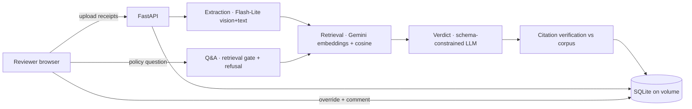

# Northwind Logistics — AI Expense Pre-Review

An AI-assisted pre-review system for a finance team. A reviewer starts a
submission for an employee, uploads receipts in mixed formats (PDF / image /
text), and the system returns a per–line-item verdict — **what it is, whether
it's compliant / flagged / rejected / needs-info, why, the policy clause it
relied on (quoted and verified), and how confident it is.** A human always makes
the final call and can override any verdict with an audited comment. The system
also answers ad-hoc policy questions with grounded citations, and declines
questions outside the policy library rather than guessing.

> **Live demo:** _<your deployed URL>_ · **Repo:** _<your GitHub URL>_

The guiding principle throughout: **be useful, but never confidently wrong.**
Where the evidence is thin, the system says so.

---

## Quickstart (local)

```bash
cd backend
python3 -m venv .venv && source .venv/bin/activate
pip install -r requirements.txt
cp .env.example .env          # then put your Gemini key in it: GEMINI_API_KEY=...

# First time only — embed the policy library (~700 clause chunks, a few minutes
# on the free tier; cached afterwards). Skipped automatically if already built.
python -m app.ingest.embed

uvicorn app.main:app --port 8000
# open http://localhost:8000
```

The only required secret is a **Gemini API key** (free at
[aistudio.google.com/apikey](https://aistudio.google.com/apikey)). Everything
else has sensible defaults in `app/config.py`.

**Models & the free-tier reality.** Both extraction and verdicts default to
`gemini-2.5-flash-lite`. We discovered the hard way that the free tier caps
`gemini-2.5-flash` at **~20 requests per day** — fine for the per-minute limits,
fatal for iterative work. Flash-Lite has a far larger daily allowance and 30
RPM, so it's the default. For higher-quality verdicts on a key with billing,
set `NW_MODEL_REASONING=gemini-2.5-flash`.

---

## Architecture

```
Browser (single-file UI, served by FastAPI)
        │  REST / multipart
        ▼
FastAPI ── seed 5 employees on startup ── restore prebuilt policy index
        │
        ├── /api/submissions ─► Pipeline (concurrent per receipt)
        │        Extraction ──► Retrieval ──► Verdict ──► Citation verify
        │        (Flash-Lite)   (embeddings)  (LLM)        (vs corpus)
        │                                   │
        │                                   ▼
        ├── Persistence (SQLite on a volume): employees · submissions ·
        │     line_items (+system verdict) · override_events (append-only)
        │
        └── /api/policy/ask ─► retrieval gate ─► grounded answer OR refusal
```



A submission is processed receipt-by-receipt, concurrently. Each receipt flows
through four independent, separately-testable stages. Results — including the
system's verdict and every reviewer override — persist in SQLite on a mounted
volume, so a submission processed yesterday is there today after a restart.

### Repo layout

```
backend/app/
  config.py        paths, model tiers, all tunables in one place
  gemini.py        SDK wrapper: embeddings + schema-constrained generation,
                   per-model rate limiting, retry/backoff, quota handling
  ingest/
    chunker.py     policy PDFs -> clause-level chunks (doc-ID + § boundaries)
    embed.py       chunk -> embed -> SQLite (idempotent, cached)
  retrieval.py     cosine search over embeddings; clause lookup for verification
  extraction.py    receipt (PDF/img/txt) -> typed ExtractedReceipt
  review.py        the verdict engine + citation faithfulness check
  qa.py            policy Q&A with retrieval gate + refusal
  schemas.py       Pydantic models that double as Gemini response_schemas
  context.py       employee / trip context
  store.py         persistence service (CRUD)
  service.py       orchestration: extract -> review -> persist (concurrent)
  models.py        ORM: employees, submissions, line_items, override_events
  main.py          FastAPI app + startup wiring; serves the UI
  scripts/         retrieval_demo, extract_demo, review_demo, evaluate, export
frontend/index.html   the whole reviewer UI (no build step)
eval/expected_sample.json   sample held-out expectations
data/                 policies/, submissions/, prebuilt policy_index.db
Dockerfile · fly.toml · README.md
```

---

## Design decisions & tradeoffs

This is the part that matters. Each choice below had a real alternative.

### 1. Clause-level chunking on document boundaries
The eight provided PDFs aren't eight documents — each concatenates several
distinct policies (`policy1.pdf` alone holds TEP-001/002/003/004), for ~30
sub-documents total with stable IDs (`TEP-002 §2.3`) and cross-references. The
chunker therefore splits **first on document-ID headers, then on numbered clause
labels**, so a citation like "TEP-003 §3.1" maps to exactly one retrievable,
quotable unit (~700 chunks, avg ~200 chars). The alternative — fixed-size
windows — would straddle clause boundaries and make faithful, section-precise
citation almost impossible. The cost is more chunks; with a corpus this small
that's free.

### 2. Retrieval: Gemini embeddings + numpy cosine, **no vector DB**
~700 chunks × 768-dim vectors is ~2 MB. We load them into one numpy matrix and
do exact cosine in-process. A Pinecone/Chroma/pgvector deployment here would be
pure operational overhead for zero recall benefit — and exact search beats ANN
at this scale. **This holds even at 10k submissions/day, because the policy
corpus doesn't grow with traffic.** We'd only reach for a vector store if the
policy library grew into the hundreds of thousands of clauses.

Per line item we issue a handful of **category-aware sub-queries** (meal → caps,
alcohol, tips, tier bumps, client-entertainment) and union the hits, which beats
a single generic query for recall. All sub-queries are embedded in **one batched
call**. The "noise" policies (data classification, records retention, etc.)
simply rank low — we deliberately don't hard-code an allowlist, because the
grader's held-out material wouldn't be on it.

### 3. Vision-first, hybrid extraction
Receipts are messy and arrive as PDF, image, or text. Rather than OCR + regex,
we hand the file to a multimodal model under a strict `response_schema`. For
PDFs we **also attach the extracted text layer**, so unambiguous lines (exact
totals, `Payment: Visa ****3214`) come through as text while photos and scanned
PDFs still fall back to pure vision. This directly fixed a real failure we hit:
vision alone occasionally dropped the payment line, which then tripped a
spurious "missing required field" flag. Extraction reports its own confidence
and warnings and **never decides compliance** — it only transcribes facts, so
each stage is independently auditable.

### 4. Schema-constrained outputs everywhere
Every model call uses a Pydantic `response_schema` (extraction, verdict, Q&A).
Downstream code never parses prose. This is the single biggest reliability lever
and is what makes citations machine-checkable.

### 5. Citation faithfulness is verified, not trusted
The brief spot-checks that "policy TEP-X says Y" is actually supported. We
enforce it automatically: every quote the model returns is checked against the
real clause text (token-level, tolerant of whitespace/layout and of a quote
**stitched from two real spans** of the same clause — e.g. a cap line plus a
city from its list — but **rejecting fabricated or number-tampered quotes**, like
a fake "$500" cap where the policy says $250). If any citation fails, the item
can never read as confidently compliant — confidence is capped and it drops to
needs-info. This caught both a real false-negative (a correct stitched quote)
and would catch hallucinated support.

### 6. Verdict taxonomy & substance-vs-documentation
Four verdicts: **compliant / flagged / rejected / needs_info**. `flagged` covers
partial issues (alcohol inside an otherwise-fine meal → reimburse the food
portion; over a cap → reimburse up to the cap). `needs_info` is the honest
"I don't know" — used when retrieval support is weak or facts are ambiguous.

A hard-won calibration: **a missing piece of documentation must never zero out
an otherwise-compliant expense.** An early version flagged a clean $298 flight
to $0 over a (mis-extracted) payment field. Now the prompt distinguishes
*substantive* violations (over cap, disallowed alcohol, wrong cabin, amount
mismatch, personal spend) from *documentation* gaps (→ needs_info for a human to
confirm, reimbursable left intact). It's also told that a null field means "not
captured," not "absent from the receipt."

**Trip context is threaded into the verdict**, not just shown in the UI. Several
cases are only judgeable with it: the alcohol-on-solo-travel case looks like a
normal dinner until you know the trip is solo; the over-cap dinner only triggers
the $75 standard cap (not the $150 client cap) because the receipt shows a solo
diner. The model is told to weigh receipt-level attendee evidence over a trip
purpose that merely *mentions* meeting partners.

### 7. Model tiering, rate limiting, caching
Extraction runs on cheaper **Flash-Lite**; verdicts default to Flash-Lite too
(free-tier survivable) with **Flash as a one-env-var upgrade**. The Gemini
wrapper enforces **per-model, thread-safe rolling-window rate limits** (the two
models have independent quotas, so the stages don't compete), honors the
server's `retry-in` hint, and **fails fast with a clear message on a per-day
quota** instead of burning retries. Extractions are **content-addressed cached**,
so re-processing an identical receipt is free.

### 8. Persistence & audit
SQLite on a volume. Verdicts are an immutable record of what the model said;
overrides are an **append-only `override_events` log** — we never mutate a
verdict in place, so the full history (who, what, why, when) is preserved and
the "effective" verdict is simply the latest override. Survives restarts;
in-memory is never used.

### 9. Deployment: one image, instant cold start
The whole thing is one container (FastAPI serves the API *and* the single-file
UI — no separate frontend build). The **prebuilt policy index ships in the repo**
and is restored to the volume on first boot, so the deployed app is usable
immediately **without spending any embedding quota at startup**.

---

## Deploy

The app is one Docker image (FastAPI serves the API and the UI). The prebuilt
policy index (`data/policy_index.db`) ships in the repo and is loaded into the
database on first boot, so the URL is usable immediately with **no embedding at
startup**. The database is swappable: SQLite locally, **Postgres in production**
(set `DATABASE_URL`).

### Free path — Render + Neon Postgres (no card)

```bash
# 1. Build the index + export the seed (DB-only, no API), then push
cd backend && python -m app.ingest.embed
python -m scripts.export_policy_index
cd .. && git add -A && git commit -m "deploy" && git push
```

2. Create a free Postgres at **[neon.tech](https://neon.tech)** → copy the
   connection string (`postgresql://...?sslmode=require`).
3. At **[render.com](https://render.com)** → New → Web Service → connect the repo
   (it reads `render.yaml`, builds the Dockerfile, free plan). Set env vars:
   `GEMINI_API_KEY` and `DATABASE_URL` (the Neon string). Deploy.

State lives in Neon, so it survives Render's restarts/redeploys. (Render's free
filesystem is ephemeral; only the re-derivable extraction cache and uploaded
files live there — all review data is in Postgres.)

### Alternative — Fly.io (persistent volume, ~$2–3/mo)

```bash
fly launch --no-deploy            # accepts bundled fly.toml
fly volume create northwind_data --size 1
fly secrets set GEMINI_API_KEY=<your-key>
fly deploy
```

Fly uses SQLite on the mounted volume (no `DATABASE_URL` needed). Any host with a
persistent disk works the same way — point `NW_STATE_DIR` at the mount.

---

## Cost & scale

**Per submission** (≈6 receipts; each = 1 extraction + 1 verdict + 1 batched
embedding call):

| Configuration | Approx. tokens (in/out) | Cost / submission |
|---|---|---|
| All Flash-Lite ($0.10/$0.40 per 1M) | ~30k / ~3.5k | **~$0.005** (half a cent) |
| Verdicts on Flash ($0.30/$2.50 per 1M) | ~30k / ~3.5k | **~$0.012** |

Embeddings are negligible and the policy corpus is embedded once.

**Scaling to 10,000 submissions/day** (~60k receipts, ~120k model calls/day,
~1.4 calls/s average):

- **Cost:** ~$50/day on Flash-Lite, ~$120/day with Flash verdicts; roughly
  halved again with the **Batch API** for non-realtime review.
- **Throughput:** trivially within a paid tier's RPM; the free tier (20/day) is
  a non-starter at any scale — production needs billing enabled.
- **What changes:** move processing to an **async job queue** with autoscaling
  workers (today it's concurrent-but-synchronous within a request); swap SQLite
  for **Postgres** for concurrent writes; put receipts in object storage; lean on
  the **receipt-hash cache** for duplicates. Retrieval stays as-is — the policy
  corpus doesn't grow with traffic, so numpy cosine remains the right call.

---

## Evaluation

`scripts/evaluate.py` takes a JSON of expected outcomes and reports the metrics
that match what this system is *for*:

```bash
cd backend
python -m scripts.evaluate ../eval/expected_sample.json --out results.json
```

| Metric | Why it's here |
|---|---|
| **Verdict exact accuracy** | Overall correctness |
| **Violation detection P / R / F1** | The core business value: catch real violations without over-flagging clean items. Recall on misses, precision on false alarms. |
| **Reimbursable within tolerance** | Are the dollar amounts (food-vs-alcohol split, cap clamping) right? |
| **Citation faithfulness rate** | Do quoted clauses actually exist? (the brief's spot-check, automated) |
| **Citation recall** | Did it cite the clause the violation actually rests on? |
| **Retrieval recall@k** | Was the deciding clause even retrieved? (isolates retrieval vs reasoning failures) |
| **Q&A correct-refusal / false-refusal** | Does it decline out-of-scope without refusing valid questions? |

`eval/expected_sample.json` encodes the true planted issues across the five
samples (clean Denver/Boston; Alinea over the $75 dinner cap; Franklin alcohol
on solo travel; Hyatt over the Seattle Tier-1 lodging cap) plus in- and
out-of-scope Q&A probes. Drop in your own held-out file with the same shape.

The harness reuses the extraction cache, so re-runs are cheap.

---

## What I'd do next

- **Confidence calibration** against a labeled set, so the numeric confidence is
  trustworthy rather than indicative; tune the needs-info / refusal thresholds
  from data (we used observed score separation: in-scope ~0.72–0.80, out ~0.64).
- **Cross-line-item reasoning** — duplicate receipts, per-day meal totals,
  trip-level approval thresholds (TEP-001 §4) — currently each line is judged
  independently.
- **Hybrid retrieval** (BM25 + dense) so exact policy IDs and dollar figures
  retrieve as reliably as paraphrases; the plain cap table occasionally ranks
  just below a related clause.
- **Async job queue + Postgres** for the 10k/day path described above.
- **Reviewer feedback loop** — overrides are labeled training/eval data; feed
  them back to measure drift and improve prompts.
- **Tighter eval** — confusion matrices per category, per-policy citation
  accuracy, and adversarial out-of-scope probes.

---

## Configuration reference

All via env (see `.env.example`): `GEMINI_API_KEY` (required),
`NW_MODEL_REASONING` / `NW_MODEL_EXTRACT`, `NW_EMBED_MODEL`, `NW_STATE_DIR`
(volume mount), `NW_RETRIEVAL_TOP_K`, and per-model rate caps
`NW_GEN_RPM` / `NW_GEN_RPM_LITE`.
